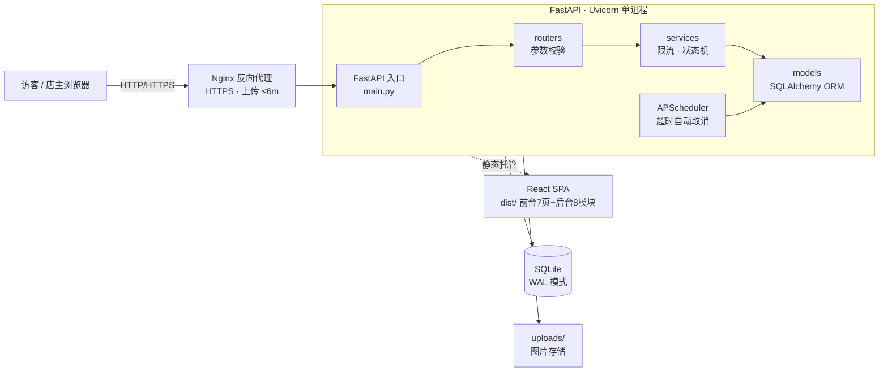
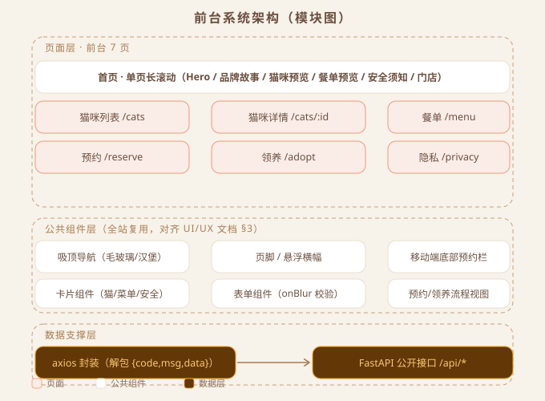
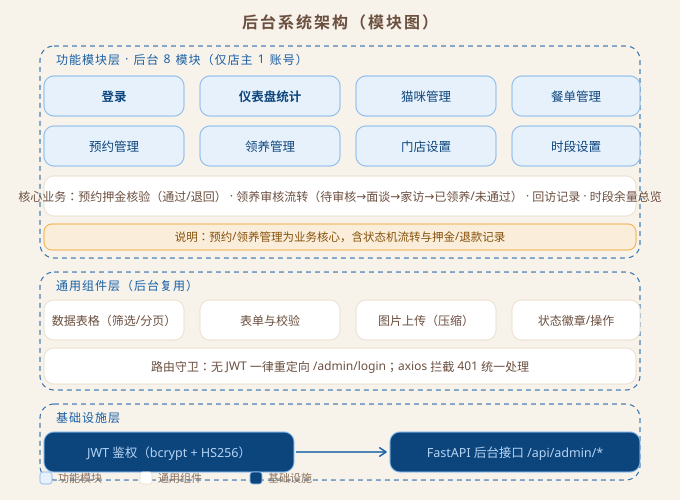
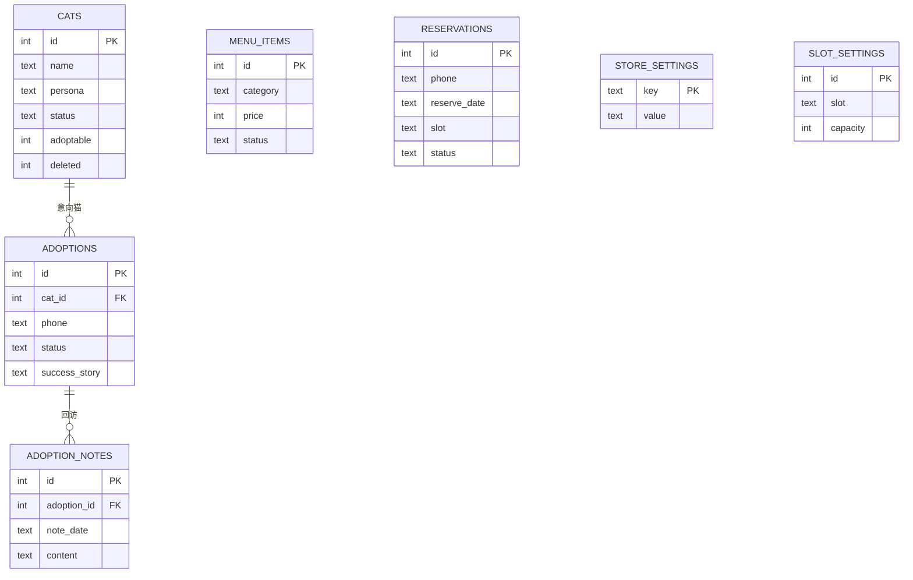

# 猫屿 CAT ISLE · 开发技术文档

| 项目 | 内容 |
| --- | --- |
| 文档名称 | 猫屿 CAT ISLE 开发技术文档 |
| 版本 | V1.2 |
| 日期 | 2026-08-26 |
| 修订记录 | V1.1 架构师审核（外键开关/CHECK/外键索引/BEGIN IMMEDIATE）；V1.2 架构师复审（防重复索引键修正为 phone+reserve_date，与数据库设计文档 V1.1 对齐） |
| 输入依据 | PRD V1.2（功能/数据模型/接口/流程）、UI/UX 设计文档 V1.0（组件/Token） |
| 技术栈 | 后端 FastAPI + SQLAlchemy + SQLite；前端 React 18 + TS + Vite + Tailwind |
| 适用阶段 | M2 后端开发 → M3 前端开发 → M4 联调上线 |

> 本文档提供开发所需的全部技术细节：目录结构、8 张表 DDL、约 30 个接口的入参/出参/错误码、关键业务逻辑实现方案与部署配置。**业务流程与字段定义以 PRD V1.2 为准，视觉规范以 UI/UX 文档 V1.0 为准。**

---

## 目录

1. [文档概述](#1-文档概述)
2. [系统架构](#2-系统架构)
3. [工程初始化](#3-工程初始化)
4. [数据库设计](#4-数据库设计)
5. [后端架构设计](#5-后端架构设计)
6. [API 接口详细设计](#6-api-接口详细设计)
7. [前端架构设计](#7-前端架构设计)
8. [关键业务逻辑实现](#8-关键业务逻辑实现)
9. [前后端开发流程](#9-前后端开发流程)
10. [测试与验收](#10-测试与验收)
11. [部署上线](#11-部署上线)

---

## 1. 文档概述

- **技术栈**：FastAPI（Python 3.11+）+ SQLAlchemy 2.x + SQLite；React 18 + TypeScript + Vite + Tailwind CSS
- **鉴权**：后端管理员 JWT（HS256，7 天有效期）；前台无鉴权
- **定时任务**：APScheduler 内嵌（超时自动取消预约）
- **图片**：本地 `uploads/` 目录 + Pillow 压缩
- **API 风格**：RESTful，统一前缀 `/api`，统一响应 `{code, msg, data}`

---

## 2. 系统架构

### 2.1 总体架构



- 单机部署：Uvicorn 同时提供 API 与前端静态资源；Nginx 反代 + HTTPS（PRD §10）
- **注意**：定时任务内嵌于 Uvicorn 进程，**生产必须单 worker 启动**（多 worker 会导致定时任务重复执行）

### 2.2 前台系统架构（模块图）



- **页面层**：前台 7 页（首页长滚动 + 猫咪列表/详情、餐单、预约、领养、隐私独立子页）
- **公共组件层**：吸顶导航、页脚/悬浮横幅、移动端底部预约栏、卡片/表单/流程视图（对齐 UI/UX 文档 §3）
- **数据支撑层**：axios 封装统一解包 `{code,msg,data}`，对接 FastAPI 公开接口 `/api/*`

### 2.3 后台系统架构（模块图）



- **功能模块层**：后台 8 模块（登录、仪表盘、猫咪/餐单/预约/领养管理、门店/时段设置），预约押金核验与领养审核流转为核心业务
- **通用组件层**：数据表格、表单校验、图片上传、状态徽章；路由守卫无 JWT 一律重定向登录
- **基础设施层**：JWT 鉴权（bcrypt + HS256）保护 `/api/admin/*` 全部接口

### 2.4 目录结构

```
cat-isle/
├── backend/
│   ├── app/
│   │   ├── __init__.py
│   │   ├── main.py               # FastAPI 实例、路由注册、静态托管、定时任务启动
│   │   ├── core/
│   │   │   ├── config.py         # pydantic-settings 读取 .env
│   │   │   ├── security.py       # JWT 签发/校验、bcrypt 密码
│   │   │   ├── deps.py           # 依赖：get_db、get_current_admin
│   │   │   ├── response.py       # 统一响应 ok()/fail()
│   │   │   └── errors.py         # 业务异常类 + 全局处理器
│   │   ├── models/               # SQLAlchemy 模型（8 张表）
│   │   ├── schemas/              # Pydantic 请求/响应模型
│   │   ├── routers/              # 路由层（薄，只做参数校验与响应组装）
│   │   │   ├── auth.py
│   │   │   ├── cats.py           # 前台猫咪 + 后台猫咪管理
│   │   │   ├── menu.py
│   │   │   ├── reservations.py
│   │   │   ├── adoptions.py
│   │   │   ├── settings.py
│   │   │   ├── stats.py
│   │   │   └── upload.py
│   │   ├── services/             # 业务逻辑（限流、状态机、防重复）
│   │   └── tasks/
│   │       ├── scheduler.py      # APScheduler 初始化
│   │       └── reservation_jobs.py
│   ├── alembic/                  # 数据库迁移
│   ├── uploads/                  # 图片存储（gitignore）
│   ├── tests/                    # pytest
│   ├── requirements.txt
│   └── .env
├── frontend/
│   ├── src/
│   │   ├── components/           # 通用组件（Button/Card/Form...）
│   │   ├── pages/                # 页面（Home/Cats/Menu/Reserve/Adopt/Privacy/Admin）
│   │   ├── api/                  # axios 封装 + 各模块 API
│   │   ├── stores/               # Zustand（admin auth）
│   │   ├── hooks/
│   │   ├── styles/               # Tailwind 主题配置
│   │   └── utils/
│   ├── package.json
│   └── vite.config.ts
└── deploy/
    ├── nginx.conf
    └── docker-compose.yml（可选）
```

---

## 3. 工程初始化

### 3.1 环境要求

| 依赖 | 版本 |
| --- | --- |
| Python | 3.11+ |
| Node.js | 18+ |
| SQLite | 3.35+（支持部分索引/`BEGIN IMMEDIATE`） |

### 3.2 后端初始化

```bash
mkdir cat-isle && cd cat-isle
python -m venv .venv && source .venv/bin/activate   # Windows: .venv\Scripts\activate
pip install fastapi uvicorn[standard] sqlalchemy alembic pydantic pydantic-settings \
            passlib[bcrypt] python-jose[cryptography] python-multipart Pillow apscheduler pytest httpx
alembic init alembic
```

**`.env` 模板**（backend/.env，gitignore）：

```ini
DATABASE_URL=sqlite:///./catisle.db
JWT_SECRET=change-me-to-random-string
JWT_EXPIRE_MINUTES=10080
ADMIN_USERNAME=admin
ADMIN_PASSWORD=change-me-on-first-login
UPLOAD_DIR=./uploads
MAX_UPLOAD_MB=5
RESERVATION_TIMEOUT_MINUTES=120
DEPOSIT_AMOUNT=20
```

### 3.3 前端初始化

```bash
npm create vite@latest frontend -- --template react-ts
cd frontend
npm i react-router-dom axios zustand
npm i -D tailwindcss @tailwindcss/vite
```

Tailwind 主题按 UI/UX 文档 §10 Token 配置（`styles/theme.ts` 或 tailwind 配置）：

```ts
// 关键色板（完整见 UI/UX §10）
colors: {
  bg: '#F7F2EA', ink: '#6B4F3F', main: '#C89F7B',
  accent: '#E8935F', btn: '#A94A26', pink: '#D96C75',
  danger: '#B4503E', success: '#5C7A3C',
}
```

---

## 4. 数据库设计

SQLite，WAL 模式（连接参数 `PRAGMA journal_mode=WAL`）。表命名小写下划线。

> **三项全局约定（重要）**
> 1. **外键**：SQLite 外键默认关闭，必须在每个连接执行 `PRAGMA foreign_keys=ON`（见 §5.5，否则 `REFERENCES` 不生效）
> 2. **时间基准**：全库统一使用**服务器本地时间**——DDL 用 `datetime('now','localtime')`，后端代码用 Python `datetime.now()`，两者必须一致（单机部署成立；若未来多机/跨时区，需整体迁移 UTC）
> 3. **`updated_at` 维护**：`DEFAULT` 仅在 INSERT 时生效，UPDATE 不会自动刷新；必须在 ORM 层配置 `onupdate=func.now()`（推荐），或使用触发器（二选一，全表统一）

### 4.1 完整 DDL（可直接执行）

```sql
PRAGMA journal_mode=WAL;
PRAGMA foreign_keys=ON;

-- 管理员（仅店主 1 个账号）
CREATE TABLE admin_user (
  id            INTEGER PRIMARY KEY AUTOINCREMENT,
  username      TEXT NOT NULL UNIQUE,
  password_hash TEXT NOT NULL,              -- bcrypt
  created_at    DATETIME NOT NULL DEFAULT (datetime('now','localtime'))
);

-- 猫咪档案
CREATE TABLE cats (
  id          INTEGER PRIMARY KEY AUTOINCREMENT,
  name        TEXT NOT NULL,
  persona     TEXT,                          -- 性格标签
  story       TEXT,                          -- 一句话故事
  breed       TEXT,
  age         TEXT,                          -- 如 "2岁"
  gender      TEXT,                          -- 公/母
  neutered    INTEGER NOT NULL DEFAULT 0 CHECK (neutered IN (0,1)),
  skills      TEXT,
  avatar_url  TEXT,
  adoptable   INTEGER NOT NULL DEFAULT 0 CHECK (adoptable IN (0,1)),
  status      TEXT NOT NULL DEFAULT 'active' CHECK (status IN ('active','offline')),
  sort_order  INTEGER NOT NULL DEFAULT 0,
  deleted     INTEGER NOT NULL DEFAULT 0 CHECK (deleted IN (0,1)),  -- 软删除
  created_at  DATETIME NOT NULL DEFAULT (datetime('now','localtime')),
  updated_at  DATETIME NOT NULL DEFAULT (datetime('now','localtime'))  -- ORM onupdate 维护
);

-- 餐单
CREATE TABLE menu_items (
  id          INTEGER PRIMARY KEY AUTOINCREMENT,
  name        TEXT NOT NULL,
  category    TEXT NOT NULL CHECK (category IN ('coffee','tea','dessert','cat_snack')),
  price       INTEGER NOT NULL CHECK (price >= 0),   -- 单位：分（避免浮点误差）
  desc        TEXT,
  image_url   TEXT,
  status      TEXT NOT NULL DEFAULT 'on_sale' CHECK (status IN ('on_sale','off_shelf')),
  sort_order  INTEGER NOT NULL DEFAULT 0,
  created_at  DATETIME NOT NULL DEFAULT (datetime('now','localtime')),
  updated_at  DATETIME NOT NULL DEFAULT (datetime('now','localtime'))
);

-- 预约
CREATE TABLE reservations (
  id                  INTEGER PRIMARY KEY AUTOINCREMENT,
  name                TEXT NOT NULL,
  phone               TEXT NOT NULL CHECK (length(phone) >= 11),  -- 格式正则由应用层校验（§6.2）
  reserve_date        TEXT NOT NULL CHECK (length(reserve_date) = 10),  -- YYYY-MM-DD
  slot                TEXT NOT NULL,         -- 如 "11:00-13:00"
  party_size          INTEGER NOT NULL CHECK (party_size BETWEEN 1 AND 6),
  has_child           INTEGER NOT NULL DEFAULT 0 CHECK (has_child IN (0,1)),
  remark              TEXT,
  status              TEXT NOT NULL DEFAULT 'pending_payment' CHECK (status IN
    ('pending_payment','payment_verify','verify_rejected','confirmed','completed','cancelled','no_show')),
  deposit_amount      INTEGER NOT NULL CHECK (deposit_amount >= 0),  -- 分（提交时快照）
  payment_proof       TEXT,                  -- JSON {trans_no?, nickname}
  verify_reject_reason TEXT,
  payment_verified_at DATETIME,
  cancel_reason       TEXT,                  -- 含退款备注
  created_at          DATETIME NOT NULL DEFAULT (datetime('now','localtime')),
  updated_at          DATETIME NOT NULL DEFAULT (datetime('now','localtime'))
);
-- 预约索引：时段余量查询（date+slot 前缀等值 + status 过滤）、手机号查询、状态筛选
CREATE INDEX idx_res_date_slot ON reservations(reserve_date, slot, status);
CREATE INDEX idx_res_phone ON reservations(phone);
CREATE INDEX idx_res_status ON reservations(status);
-- 防重复：同一手机号同一天仅 1 个"占用中"预约（部分唯一索引；键=phone+reserve_date，WHERE 过滤占用状态）
-- 注意：键严禁包含 status，否则同一手机号同日可存在多条不同状态的占用记录
CREATE UNIQUE INDEX uq_res_phone_date ON reservations(phone, reserve_date)
  WHERE status IN ('pending_payment','payment_verify','verify_rejected','confirmed');

-- 领养申请
CREATE TABLE adoptions (
  id            INTEGER PRIMARY KEY AUTOINCREMENT,
  cat_id        INTEGER REFERENCES cats(id),  -- 可空：允许不指定意向猫（表单下拉为推荐非强制）
  name          TEXT NOT NULL,
  phone         TEXT NOT NULL CHECK (length(phone) >= 11),
  city          TEXT NOT NULL,
  housing       TEXT NOT NULL,               -- 自有/整租/合租+室友同意
  experience    TEXT,
  family_agreed TEXT,
  reason        TEXT NOT NULL,
  photos        TEXT,                        -- JSON 数组（上传路径）
  status        TEXT NOT NULL DEFAULT 'pending' CHECK (status IN
    ('pending','interview','home_check','adopted','rejected')),
  admin_note    TEXT,
  adopted_at    TEXT,                        -- 领养完成日期
  success_story TEXT,                        -- 前台案例墙
  success_photo TEXT,
  created_at    DATETIME NOT NULL DEFAULT (datetime('now','localtime')),
  updated_at    DATETIME NOT NULL DEFAULT (datetime('now','localtime'))
);
CREATE INDEX idx_adopt_status ON adoptions(status);
CREATE INDEX idx_adopt_cat ON adoptions(cat_id);          -- 外键索引（SQLite 不自动建）

-- 领养回访记录
CREATE TABLE adoption_notes (
  id          INTEGER PRIMARY KEY AUTOINCREMENT,
  adoption_id INTEGER NOT NULL REFERENCES adoptions(id),
  note_date   TEXT NOT NULL,                 -- YYYY-MM-DD
  content     TEXT NOT NULL,
  created_at  DATETIME NOT NULL DEFAULT (datetime('now','localtime'))
);
CREATE INDEX idx_notes_adoption ON adoption_notes(adoption_id);  -- 外键索引

-- 门店配置（key-value；约定：deposit_amount 存整数文本如 "20"，其余存字符串/URL）
CREATE TABLE store_settings (
  key   TEXT PRIMARY KEY,   -- store_name/address/phone/hours/map_embed/wechat_qr_url/deposit_amount
  value TEXT
);

-- 时段容量
CREATE TABLE slot_settings (
  id       INTEGER PRIMARY KEY AUTOINCREMENT,
  slot     TEXT NOT NULL UNIQUE,             -- "11:00-13:00"...
  capacity INTEGER NOT NULL DEFAULT 6 CHECK (capacity > 0),
  is_open  INTEGER NOT NULL DEFAULT 1 CHECK (is_open IN (0,1)),
  holidays TEXT NOT NULL DEFAULT '[1]'       -- JSON 数组，1=周一，支持多天
);
```

**初始数据（种子脚本）**：4 个时段（11:00-13:00 / 13:00-15:00 / 15:00-17:00 / 17:00-19:00，capacity=6）、deposit_amount=20、默认管理员（由环境变量注入）。

### 4.2 ER 关系



> 说明：仅 `adoptions.cat_id`、`adoption_notes.adoption_id` 存在外键；`reservations` 独立（phone/date/slot 业务维度，无外键）；`store_settings` / `slot_settings` / `admin_user` / `menu_items` 为无关联配置或独立表。

**E-R 图（SVG 渲染图）**：


### 4.3 迁移策略

- Alembic：`alembic revision --autogenerate -m "init"` → `alembic upgrade head`；`--autogenerate` 无法捕获 CHECK/部分索引变更，需在迁移文件中手工核对
- `updated_at` 维护：ORM 层统一配置 `onupdate=func.now()`（SQLAlchemy `DateTime` 字段），**所有含 updated_at 的表一并配置**；如用原生 SQL 更新，需补触发器
- 生产环境小表（配置表）直接用种子脚本 `backend/app/core/seed.py` 初始化

---

## 5. 后端架构设计

### 5.1 分层规范

| 层 | 职责 | 禁止 |
| --- | --- | --- |
| routers | 参数校验、调用 service、组装响应 | 直接写 SQL、业务判断 |
| services | 业务规则（限流/状态机/防重复/统计） | 返回 HTTP 对象 |
| models | ORM 模型 | 业务逻辑 |
| schemas | Pydantic 出入参 | 访问数据库 |

### 5.2 统一响应与错误码

```python
# core/response.py
def ok(data=None, msg="ok"):       return {"code": 0, "msg": msg, "data": data}
def fail(code, msg):               return {"code": code, "msg": msg, "data": None}
```

| 错误码 | 含义 | 典型场景 |
| --- | --- | --- |
| 40001 | 参数错误 | 手机号格式不正确 |
| 40002 | 时段已满 | 限流校验失败 |
| 40003 | 重复预约 | 同手机号同日已存在占用预约 |
| 40004 | 店休不可约 | 周一/店休日 |
| 40005 | 状态不允许 | 状态机非法流转 |
| 40101 | 未登录 | 无/过期 JWT |
| 40102 | 登录失败/账号锁定 | 密码错误、5 次锁定 |
| 40401 | 资源不存在 | 单号/ID 无效 |
| 50000 | 服务器内部错误 | 兜底 |

### 5.3 认证实现（core/security.py）

- 密码：`passlib` bcrypt；登录失败计数：内存字典 `{username: {count, locked_until}}`，5 次锁定 15 分钟（单实例可接受，重启清零）
- JWT：`python-jose`，HS256，payload `{sub: username, exp}`，7 天
- 依赖：`get_current_admin` 校验 `Authorization: Bearer <token>`，失败抛 40101

### 5.4 定时任务（tasks/scheduler.py）

```python
from apscheduler.schedulers.background import BackgroundScheduler

def start_scheduler(app_state):
    sched = BackgroundScheduler(timezone="Asia/Shanghai")
    # 每 5 分钟：扫描超时未支付/超时未重提的预约 → cancelled
    sched.add_job(scan_expired_reservations, "interval", minutes=5)
    sched.start()
    return sched
```

- 在 `main.py` 的 lifespan 中启动，应用关闭时 shutdown
- **生产 Uvicorn 必须 `--workers 1`**，避免定时任务多实例重复执行

### 5.5 SQLite 并发与事务（core/db.py）

```python
from sqlalchemy import create_engine, event

engine = create_engine(
    settings.DATABASE_URL,
    connect_args={"check_same_thread": False, "timeout": 30},
    pool_pre_ping=True,
)

@event.listens_for(engine, "connect")
def set_sqlite_pragma(dbapi_conn, _):
    cur = dbapi_conn.cursor()
    cur.execute("PRAGMA journal_mode=WAL")        # 防读写互斥（每次连接）
    cur.execute("PRAGMA foreign_keys=ON")         # 关键：SQLite 外键默认关闭，必须逐连接开启
    cur.execute("PRAGMA busy_timeout=30000")      # 等待锁 30s，减少并发写冲突
    cur.close()
```

> **写事务必须用 `BEGIN IMMEDIATE`**（见 §8.1）：默认 deferred 事务在并发下两个请求可同时通过"名额 COUNT"检查再插入，导致超卖。SQLite 在 SQLAlchemy 中设置连接 `isolation_level="IMMEDIATE"`，或在写入前显式执行 `BEGIN IMMEDIATE` 获取写锁。

---

## 6. API 接口详细设计

> 通用：前缀 `/api`；响应统一 `{code, msg, data}`；后台接口需 `Authorization: Bearer <JWT>`。
> 开发调试：FastAPI 自动生成 Swagger `/docs`。

### 6.1 认证（2 个）

**POST `/api/admin/auth/login`**

```jsonc
// 请求
{ "username": "admin", "password": "xxx" }
// 响应 200
{ "code": 0, "msg": "ok", "data": { "token": "<jwt>", "expires_in": 604800 } }
// 错误：40102 密码错误/账号锁定
```

**GET `/api/admin/auth/me`**（JWT）→ `data: {"username": "admin"}`

### 6.2 前台公开接口（12 个）

| 方法 | 路径 | 说明 | 关键业务规则 |
| --- | --- | --- | --- |
| GET | `/api/cats` | 猫咪列表 | `?adoptable=1` 过滤；仅 `status=active AND deleted=0`；按 sort_order |
| GET | `/api/cats/{id}` | 猫咪详情 | 不存在→40401 |
| GET | `/api/menu` | 餐单列表 | 仅 `on_sale`，按 sort_order |
| GET | `/api/slots?date=2026-09-01` | 时段余量 | 店休日→返回 `is_holiday:true`；余量=capacity-占用数（占用=4 状态） |
| POST | `/api/reservations` | 提交预约 | 见下方详例（核心） |
| POST | `/api/reservations/{id}/payment-proof` | 提交押金凭证 | body `{phone, trans_no?, nickname}`；校验手机号归属；仅 pending_payment 可提交 |
| GET | `/api/reservations/status?id=&phone=` | 查询状态 | 单号+手机号双重匹配，否则 40401 |
| POST | `/api/reservations/{id}/cancel` | 顾客取消 | 仅限 pending_payment/payment_verify/verify_rejected；手机号归属校验；confirmed 后需联系店主（返回 40005） |
| POST | `/api/adoptions` | 提交领养申请 | 字段见 PRD §4.5；photos 为已上传 URL 数组 |
| GET | `/api/store` | 门店信息 | 从 store_settings 读取 |
| GET | `/api/adopted-cats` | 领养成功案例 | `status=adopted AND success_story IS NOT NULL` |
| POST | `/api/upload` | 图片上传（公开） | **仅限领养场景**；`?scene=adoption`；限 5MB/jpg/png/webp |

**POST `/api/reservations`（核心，详例）**

```jsonc
// 请求
{
  "name": "张三", "phone": "13800000000",
  "reserve_date": "2026-09-01", "slot": "13:00-15:00",
  "party_size": 2, "has_child": false, "remark": "想见奶糖"
}
// 响应 200
{
  "code": 0, "msg": "ok",
  "data": {
    "id": 1, "reservation_no": "R20260901-0001",
    "status": "pending_payment",
    "deposit_amount": 2000,           // 分
    "timeout_minutes": 120
  }
}
// 错误：40001 手机号格式 / 40002 时段已满 / 40003 同日已预约 / 40004 店休 / 40001 人数超限(>6)
```

**业务规则（service 层执行顺序）**：
1. 校验手机号正则 → 40001
2. 校验日期非过去 + 非店休（查 slot_settings.holidays）→ 40004
3. 同手机号同日唯一约束 → 40003
4. **事务内**：数占用数（4 状态）< capacity → 否则 40002；插入记录（快照 deposit_amount）→ commit
5. 预约单号生成：`R{date:YYYYMMDD}-{id:04d}`

### 6.3 后台接口（需 JWT，17 个）

| 方法 | 路径 | 说明 |
| --- | --- | --- |
| GET/POST | `/api/admin/cats` | 列表（含 offline）/ 新建 |
| PUT/DELETE | `/api/admin/cats/{id}` | 编辑（含上下线/可领养）/ 软删除 |
| GET/POST | `/api/admin/menu` | 列表 / 新建 |
| PUT/DELETE | `/api/admin/menu/{id}` | 编辑（含上下架）/ 删除 |
| GET | `/api/admin/reservations?date=&status=&phone=` | 列表筛选（分页：page/size） |
| PUT | `/api/admin/reservations/{id}/verify-payment` | body `{result:"pass"/"reject", reason?}`；pass→confirmed（记 verified_at）；reject→verify_rejected |
| PUT | `/api/admin/reservations/{id}` | body `{action:"cancel"/"arrive"/"no_show", reason?}`；cancel 需填写退款备注 |
| GET | `/api/admin/reservations/overview?date=` | 日历余量总览（4 时段 × 已约/容量） |
| GET | `/api/admin/adoptions?status=` | 领养申请列表 |
| GET | `/api/admin/adoptions/{id}` | 申请详情（含 photos） |
| PUT | `/api/admin/adoptions/{id}` | 审核流转 `{status, note?}`；adopted 时写 adopted_at |
| GET/POST | `/api/admin/adoptions/{id}/notes` | 回访记录列表 / 新增 `{note_date, content}` |
| GET/PUT | `/api/admin/settings` | 门店配置读写（含收款码图片上传后 URL） |
| GET/PUT | `/api/admin/slot-settings` | 时段/容量/店休配置 |
| GET | `/api/admin/stats` | 仪表盘：今日预约/待核验/待审核/在店猫数 + 近 7 日趋势 |
| POST | `/api/upload` | 图片上传（后台）`?scene=admin`；压缩后存 uploads |

---

## 7. 前端架构设计

### 7.1 路由表

| 路由 | 页面 | 说明 |
| --- | --- | --- |
| `/` | Home | 单页长滚动（UI/UX §4.1 九区块） |
| `/cats` | CatList | 猫咪列表 + 可领养筛选 |
| `/cats/:id` | CatDetail | 猫咪详情 |
| `/menu` | Menu | 餐单（分类 Tab） |
| `/reserve` | Reserve | 预约表单 + 押金流程 + 状态查询 |
| `/adopt` | Adopt | 领养流程 + 申请表 |
| `/privacy` | Privacy | 隐私政策 |
| `/admin/login` | AdminLogin | 后台登录 |
| `/admin/*` | AdminLayout | 后台工作台（仪表盘/猫咪/餐单/预约/领养/设置）—— 路由守卫：无 JWT 跳登录 |

### 7.2 组件划分（对齐 UI/UX 文档 §3）

| 组件 | 对应规范 |
| --- | --- |
| `Navbar` / `Footer` / `FloatingBanner` / `MobileBottomBar` | UI/UX §3.1/§3.5/§3.6 |
| `Button`（primary/ghost/disabled） | §3.2 |
| `CatCard` / `MenuCard` / `SafetyCard` | §3.3 |
| `FormField` / `Input` / `SlotPicker` / `DepositPanel` / `StatusCard` | §3.4 + §5 |
| `StepBar`（领养 5 步） | §6 |
| `ImageUpload`（压缩预览） | §4.5 |

### 7.3 状态管理（Zustand）

```ts
// stores/admin.ts —— 仅后台鉴权需要
{ token, username, login(), logout() }   // token 持久化 localStorage
```

前台无需全局状态（预约表单/押金流程为页面内状态，不跨页）。

### 7.4 API 封装（api/client.ts）

```ts
const http = axios.create({ baseURL: import.meta.env.VITE_API_BASE || '/api' })
// 请求拦截：附加 Bearer token
// 响应拦截：解包 {code,msg,data}；code!==0 → 统一 toast(msg)；401 → 跳 /admin/login
// 上传：FormData，scene 参数区分前台/后台
```

### 7.5 关键页面交互实现要点

- **预约页**：选择日期 → `GET /api/slots` 刷新余量 → 提交 → 进入押金面板（收款码图 + 凭证表单 + 倒计时，用 `setInterval` 每秒刷新；到 0 自动刷新状态）
- **状态查询**：单号 + 手机号 → 按返回 status 渲染 5 种状态卡（UI/UX §5）
- **管理员预约核验**：列表行内操作按钮（核验通过/退回/取消/到店/爽约），操作后刷新列表

---

## 8. 关键业务逻辑实现

### 8.1 预约限流防超卖（service）

```python
def create_reservation(db, data):
    # 1. 参数/店休/防重复校验（略，见 §6.2）
    # 关键：必须 IMMEDIATE 事务 —— 先获取写锁，阻止并发请求同时通过 COUNT 检查（防超卖核心）
    db.execute(text("BEGIN IMMEDIATE"))
    try:
        occupied = db.execute(
            text("SELECT COUNT(*) FROM reservations WHERE reserve_date=:d AND slot=:s "
                 "AND status IN ('pending_payment','payment_verify','verify_rejected','confirmed')"),
            {"d": data.reserve_date, "s": data.slot}).scalar()
        cap = get_capacity(db, data.slot)
        if occupied >= cap:
            raise BizError(40002, "该时段已约满")
        # 同手机号同日唯一索引兜底：IntegrityError → 40003
        r = Reservation(..., deposit_amount=get_deposit(db))
        db.add(r)
        db.commit()
    except Exception:
        db.rollback()
        raise
    return r
```

> **防超卖必须 `BEGIN IMMEDIATE`**（或连接 `isolation_level="IMMEDIATE"`）：SQLite 默认 deferred 事务在读后写前不持锁，两个并发请求可同时读到"占用=5<6"再先后插入，造成第 7 单超卖。`BEGIN IMMEDIATE` 在事务开始即获取写锁，将检查+插入串行化。业务异常（40002/40003）需 `rollback` 释放写锁。

### 8.2 预约状态机（合法流转矩阵）

| 当前 \ 触发 | 填凭证 | 核验通过 | 核验退回 | 取消 | 超时 | 到店 | 爽约 |
| --- | --- | --- | --- | --- | --- | --- | --- |
| pending_payment | →payment_verify | ✗ | ✗ | →cancelled | →cancelled | ✗ | ✗ |
| payment_verify | ✗ | →confirmed | →verify_rejected | →cancelled | ✗ | ✗ | ✗ |
| verify_rejected | →payment_verify | ✗ | ✗ | →cancelled | →cancelled(限时) | ✗ | ✗ |
| confirmed | ✗ | ✗ | ✗ | 联系店主(40005) | ✗ | →completed | →no_show |
| cancelled/completed/no_show | 终态 | 终态 | 终态 | 终态 | 终态 | 终态 | 终态 |

### 8.3 超时自动取消（定时任务）

```python
def scan_expired_reservations():
    now = datetime.now()
    with SessionLocal() as db:
        # 待支付超 120 分钟（配置）
        db.execute(text("UPDATE reservations SET status='cancelled', cancel_reason='超时未支付自动取消' "
                        "WHERE status='pending_payment' AND created_at < :t"),
                   {"t": now - timedelta(minutes=settings.RESERVATION_TIMEOUT_MINUTES)})
        # 核验未通过超 120 分钟未重提 → 取消（释放名额）
        db.execute(text("UPDATE reservations SET status='cancelled', cancel_reason='核验未通过超时' "
                        "WHERE status='verify_rejected' AND updated_at < :t"), {"t": now - timedelta(hours=2)})
        db.commit()
```

### 8.4 图片上传压缩

```python
def save_image(file: UploadFile, scene: str) -> str:
    ext = file.filename.rsplit(".", 1)[-1].lower()
    if ext not in {"jpg", "jpeg", "png", "webp"}: raise BizError(40001, "仅支持 jpg/png/webp")
    if file.size > 5 * 1024 * 1024: raise BizError(40001, "图片不能超过 5MB")
    img = Image.open(file.file)
    img.thumbnail((1600, 1600))            # 长边 ≤1600
    name = f"{uuid4().hex}.webp"
    img.save(f"{UPLOAD_DIR}/{scene}/{name}", "WEBP", quality=80)   # ≤300KB 目标
    return f"/uploads/{scene}/{name}"
```

- 权限：`scene=adoption` 公开（仅领养）；`scene=admin` 需 JWT
- 访问：FastAPI `StaticFiles(directory="uploads", url="/uploads")`

### 8.5 同手机号防重复

- 数据库唯一部分索引（DDL §4.1）兜底 + 应用层先查（友好报错 40003）

---

## 9. 前后端开发流程

### 9.1 开发顺序（对齐 PRD §12）

1. **M2 后端先行**：DDL → 模型/迁移 → 认证 → 前台接口 → 后台接口 → 定时任务 → pytest
2. **M3 前端并行**：Tailwind 主题 → 组件库 → 前台 7 页 → 后台 8 模块（后端未就绪时用 mock）
3. **M4 联调**：Swagger 对接口 → 替换 mock → 验收清单逐项过

### 9.2 联调规范

- 后端调试：`uvicorn app.main:app --reload`，Swagger 在 `http://localhost:8000/docs`
- 前端 mock：开发期 `vite-plugin-mock` 或 MSW 按 §6 接口结构返回假数据；联调时切 `VITE_API_BASE=/api`
- 代理：`vite.config.ts` 配置 `server.proxy: {'/api': 'http://localhost:8000'}`

### 9.3 Git 约定

```
main        # 可发布
develop     # 集成
feature/*   # 功能分支：feature/backend-reservation、feature/frontend-home...
提交信息：feat(模块): 描述  /  fix(模块): 描述
```

---

## 10. 测试与验收

### 10.1 后端 pytest 用例清单

| 模块 | 用例 |
| --- | --- |
| auth | 登录成功；密码错误；连续 5 次锁定；无 token 访问后台接口 → 401 |
| reservations | 正常创建；满员拒绝(40002)；同手机号同日重复(40003)；周一不可约(40004)；凭证提交归属校验；核验通过/退回；顾客取消；超时任务释放名额（mock now） |
| adoptions | 申请创建；状态流转合法/非法；adopted 写 adopted_at；回访增查 |
| upload | 类型/大小校验；压缩产物存在且 <300KB |

```bash
pytest backend/tests -v
```

### 10.2 前端测试要点

- 组件：Button 三态、SlotPicker 满员禁用、StatusCard 5 状态渲染
- 流程（可用 Playwright 冒烟）：预约全流程、登录守卫

### 10.3 验收映射（PRD §11 的 11 项）

| PRD 验收 | 技术验证 |
| --- | --- |
| 1 预约全流程 | pytest test_reservations + 前端联调脚本 |
| 2 押金超时 | 超时任务单测（缩短配置验证） |
| 3 店休日 | slots 接口返回 is_holiday + 前端置灰 |
| 4 领养流程 | test_adoptions |
| 5 后台鉴权 | 401 拦截 + 路由守卫 |
| 6 内容管理 | 前台接口仅取 active/on_sale |
| 7 响应式 | 375/768/1280/1440 截图对比 |
| 8 数据安全 | 软删除断言 + 上传类型校验 |
| 9 防超卖 | 并发测试（threads=10 提交 8 单，仅 6 单成功） |
| 10 顾客取消 | test 取消后名额释放 |
| 11 图片压缩 | 上传 2MB 图，产物 <300KB |

---

## 11. 部署上线

### 11.1 构建与启动

```bash
# 前端构建
cd frontend && npm run build          # 产物 dist/
# 后端：将 dist 复制到 backend/static，main.py 挂载
app.mount("/", StaticFiles(directory="static", html=True), name="static")

# 启动（必须单 worker，含定时任务）
cd backend && uvicorn app.main:app --host 0.0.0.0 --port 8000 --workers 1
```

### 11.2 Nginx 配置要点（deploy/nginx.conf）

```nginx
server {
    listen 443 ssl;
    server_name catisle.example.com;
    ssl_certificate     /etc/ssl/cert.pem;
    ssl_certificate_key /etc/ssl/key.pem;

    client_max_body_size 6m;                    # 上传限制略大于 5MB
    location / {
        proxy_pass http://127.0.0.1:8000;       # 前端静态+API 均由 FastAPI 提供
        proxy_set_header Host $host;
    }
    # 大文件上传不缓存
    location /api/upload { proxy_pass http://127.0.0.1:8000; proxy_buffering off; }
}
```

### 11.3 运维清单

- **备份**：cron 每日备份 `catisle.db` 与 `uploads/`（`sqlite3 catisle.db ".backup backup.db"`）
- **管理员初始化**：首次启动执行 `seed.py`，从 `.env` 读取 ADMIN_USERNAME/ADMIN_PASSWORD 创建账号，**首次登录强制改密提示**
- **上线检查**：域名备案 ✓ / HTTPS ✓ / 收款码图片已上传（store_settings.wechat_qr_url）/ 时段容量已配置 / 定时任务日志无报错
- 可选：Docker Compose（backend + nginx 两个服务）一键启动

---

> 本文档与 PRD V1.2、UI/UX 设计文档 V1.0 配套使用。接口或字段与 PRD 冲突时，以本文档落库实现为准并向产品确认。
