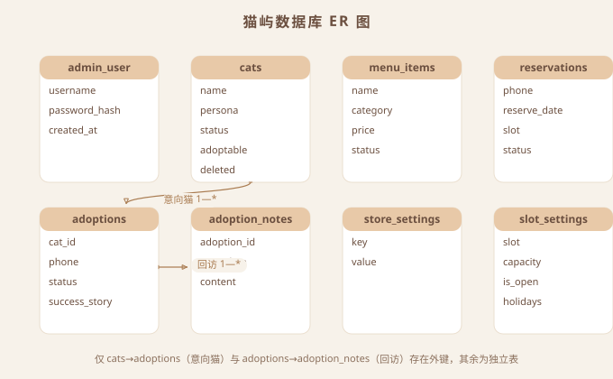
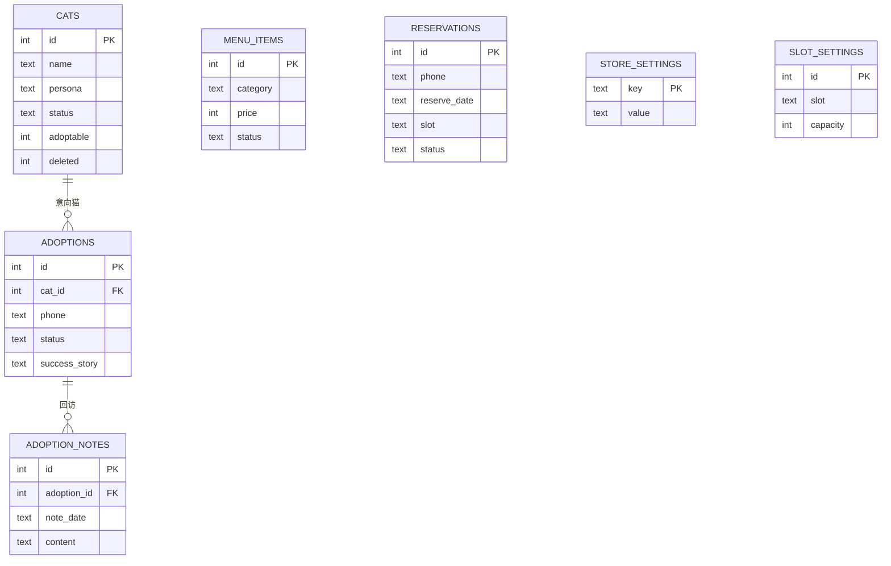

# 猫屿 CAT ISLE · 数据库设计文档

| 项目 | 内容 |
| --- | --- |
| 文档名称 | 猫屿 CAT ISLE 数据库设计文档 |
| 版本 | V1.1 |
| 日期 | 2026-08-26 |
| 输入依据 | PRD V1.2 §7（数据模型）、开发技术文档 V1.2 §4（DDL/ER/架构师审核修订） |
| 数据库 | SQLite 3.35+（WAL 模式） |
| ORM | SQLAlchemy 2.x |
| 适用阶段 | M2 后端开发建库 |

> 本文档为数据库设计的三件套交付：**ER 图（SVG）+ 数据字典 + 建表 SQL**。建表 SQL 与开发技术文档 V1.1 的 DDL 严格一致（唯一真源），如发现不一致**以本文档 §4 建表 SQL 为准**，并在修订记录中登记差异。

---

## 目录

1. [文档概述与全局约定](#1-文档概述与全局约定)
2. [ER 图](#2-er-图)
3. [数据字典](#3-数据字典)
4. [建表 SQL](#4-建表-sql)
5. [设计决策说明](#5-设计决策说明)
6. [维护与迁移](#6-维护与迁移)
7. [附录](#7-附录)

---

## 1. 文档概述与全局约定

### 1.1 概述

数据库承载猫屿官网全部业务数据：内容管理（猫咪/餐单）、预约与押金流程、领养审核与回访、门店与时段配置。共 **8 张表**，其中仅 2 条外键关系。

### 1.2 全局约定（务必遵守）

| # | 约定 | 说明 |
| --- | --- | --- |
| 1 | **外键开关** | SQLite 外键默认关闭，每个连接必须执行 `PRAGMA foreign_keys=ON`（否则 `REFERENCES` 不生效） |
| 2 | **时间基准** | 全库统一服务器本地时间：DDL 用 `datetime('now','localtime')`，后端用 Python `datetime.now()` |
| 3 | **updated_at 维护** | `DEFAULT` 仅插入生效；ORM 层统一配置 `onupdate=func.now()`（或触发器），全表一致 |
| 4 | **金额存储** | 金额一律以"分"为单位 `INTEGER` 存储，展示时 ÷100（避免浮点误差） |
| 5 | **软删除** | 业务数据（cats）用 `deleted` 标记软删除，不做物理删除；adoptions 引用不失效 |
| 6 | **命名** | 表名/字段名小写下划线；布尔字段用 `INTEGER 0/1`；状态字段用 `TEXT` 枚举 |
| 7 | **WAL 模式** | 连接级 `PRAGMA journal_mode=WAL`，支持并发读写 |

---

## 2. ER 图

### 2.1 ER 图（SVG 渲染图）

> 由「架构图与流程图绘制专家」技能将 Mermaid 源码转换为 SVG 图片（`catisle-er-diagram.svg`，与本文档同目录）：



### 2.2 关系说明

| 关系 | 基数 | 说明 |
| --- | --- | --- |
| cats → adoptions | 1 — * | 一只猫可被多个领养申请意向（`adoptions.cat_id`，可空——允许不指定意向猫） |
| adoptions → adoption_notes | 1 — * | 一个已领养申请可有多条回访记录（`adoption_notes.adoption_id`） |

**无外键关系的表**：`admin_user`（独立账号）、`menu_items`（独立内容）、`reservations`（phone/date/slot 业务维度，无外键）、`store_settings` / `slot_settings`（配置表）。

### 2.3 Mermaid 源码（对照）



---

## 3. 数据字典

> 图例：PK=主键，FK=外键，UQ=唯一约束，NN=非空，DF=默认值，CK=CHECK 约束。

### 3.1 admin_user（管理员表）

| 字段 | 类型 | 约束 | 默认 | 说明 |
| --- | --- | --- | --- | --- |
| id | INTEGER | PK, NN | AUTOINCREMENT | 自增主键 |
| username | TEXT | NN, UQ | — | 登录名 |
| password_hash | TEXT | NN | — | bcrypt 密码哈希 |
| created_at | DATETIME | NN | localtime | 创建时间 |

### 3.2 cats（猫咪档案表）

| 字段 | 类型 | 约束 | 默认 | 说明 |
| --- | --- | --- | --- | --- |
| id | INTEGER | PK, NN | AUTOINCREMENT | 自增主键 |
| name | TEXT | NN | — | 名字，如"奶糖" |
| persona | TEXT | — | — | 性格标签，如"撒娇大王" |
| story | TEXT | — | — | 一句话故事（≤30 字） |
| breed | TEXT | — | — | 品种 |
| age | TEXT | — | — | 年龄描述，如"2岁"（文本，展示友好） |
| gender | TEXT | — | — | 公/母 |
| neutered | INTEGER | NN, CK(0,1) | 0 | 是否绝育 |
| skills | TEXT | — | — | 技能，如"会击掌" |
| avatar_url | TEXT | — | — | 照片路径 |
| adoptable | INTEGER | NN, CK(0,1) | 0 | 是否可领养 |
| status | TEXT | NN, CK(active,offline) | 'active' | 上下线 |
| sort_order | INTEGER | NN | 0 | 排序（小在前） |
| deleted | INTEGER | NN, CK(0,1) | 0 | 软删除标记 |
| created_at | DATETIME | NN | localtime | 创建时间 |
| updated_at | DATETIME | NN | localtime | 更新时间（ORM onupdate 维护） |

### 3.3 menu_items（餐单表）

| 字段 | 类型 | 约束 | 默认 | 说明 |
| --- | --- | --- | --- | --- |
| id | INTEGER | PK, NN | AUTOINCREMENT | 自增主键 |
| name | TEXT | NN | — | 菜品名 |
| category | TEXT | NN, CK(coffee,tea,dessert,cat_snack) | — | 分类：咖啡/茶饮/甜品/猫零食 |
| price | INTEGER | NN, CK(>=0) | — | 价格（分） |
| desc | TEXT | — | — | 描述（`desc` 为 SQL 关键字，ORM 自动转义；原生 SQL 需引号引用，建议后续更名 description） |
| image_url | TEXT | — | — | 图片路径 |
| status | TEXT | NN, CK(on_sale,off_shelf) | 'on_sale' | 上下架 |
| sort_order | INTEGER | NN | 0 | 排序 |
| created_at | DATETIME | NN | localtime | 创建时间 |
| updated_at | DATETIME | NN | localtime | 更新时间 |

### 3.4 reservations（预约表，核心表）

| 字段 | 类型 | 约束 | 默认 | 说明 |
| --- | --- | --- | --- | --- |
| id | INTEGER | PK, NN | AUTOINCREMENT | 预约单号（展示为 R+日期+序号） |
| name | TEXT | NN | — | 顾客姓名 |
| phone | TEXT | NN, CK(length>=11) | — | 手机号（格式正则由应用层校验） |
| reserve_date | TEXT | NN, CK(length=10) | — | 预约日期 YYYY-MM-DD |
| slot | TEXT | NN | — | 时段，如"11:00-13:00" |
| party_size | INTEGER | NN, CK(1-6) | — | 人数（单组 ≤6） |
| has_child | INTEGER | NN, CK(0,1) | 0 | 是否有 6 岁以下儿童 |
| remark | TEXT | — | — | 备注（过敏史/想见的猫等） |
| status | TEXT | NN, CK(见附录 A) | 'pending_payment' | 7 状态（状态机见 PRD §6.1） |
| deposit_amount | INTEGER | NN, CK(>=0) | — | 押金金额（分，提交时快照） |
| payment_proof | TEXT | — | — | 支付凭证 JSON `{trans_no?, nickname}` |
| verify_reject_reason | TEXT | — | — | 押金核验不通过原因 |
| payment_verified_at | DATETIME | — | — | 核验通过时间 |
| cancel_reason | TEXT | — | — | 取消原因 + 退款备注 |
| created_at | DATETIME | NN | localtime | 创建时间（用于超时判断） |
| updated_at | DATETIME | NN | localtime | 更新时间 |

### 3.5 adoptions（领养申请表）

| 字段 | 类型 | 约束 | 默认 | 说明 |
| --- | --- | --- | --- | --- |
| id | INTEGER | PK, NN | AUTOINCREMENT | 自增主键 |
| cat_id | INTEGER | FK→cats.id | 可空 | 意向猫咪（可空：允许不指定） |
| name | TEXT | NN | — | 申请人姓名 |
| phone | TEXT | NN, CK(length>=11) | — | 手机号 |
| city | TEXT | NN | — | 所在城市 |
| housing | TEXT | NN | — | 居住情况：自有/整租/合租+室友同意 |
| experience | TEXT | — | — | 养宠经验 |
| family_agreed | TEXT | — | — | 家人是否同意 |
| reason | TEXT | NN | — | 领养理由 |
| photos | TEXT | — | — | 环境照片路径 JSON 数组 |
| status | TEXT | NN, CK(见附录 A) | 'pending' | 5 状态（审核流转） |
| admin_note | TEXT | — | — | 审核备注 |
| adopted_at | TEXT | — | — | 领养完成日期（status=adopted 时填） |
| success_story | TEXT | — | — | 领养成功故事（前台案例墙） |
| success_photo | TEXT | — | — | 成功案例照片 |
| created_at | DATETIME | NN | localtime | 创建时间 |
| updated_at | DATETIME | NN | localtime | 更新时间 |

### 3.6 adoption_notes（领养回访记录表）

| 字段 | 类型 | 约束 | 默认 | 说明 |
| --- | --- | --- | --- | --- |
| id | INTEGER | PK, NN | AUTOINCREMENT | 自增主键 |
| adoption_id | INTEGER | NN, FK→adoptions.id | — | 所属领养申请 |
| note_date | TEXT | NN | — | 回访日期 YYYY-MM-DD |
| content | TEXT | NN | — | 回访内容 |
| created_at | DATETIME | NN | localtime | 创建时间 |

### 3.7 store_settings（门店配置表，key-value）

| 字段 | 类型 | 约束 | 说明 |
| --- | --- | --- | --- |
| key | TEXT | PK, NN | 配置键：store_name / address / phone / hours / map_embed / wechat_qr_url / deposit_amount |
| value | TEXT | — | 配置值（约定：deposit_amount 存整数文本如"20"，其余存字符串/URL/iframe 代码） |

### 3.8 slot_settings（时段容量表）

| 字段 | 类型 | 约束 | 默认 | 说明 |
| --- | --- | --- | --- | --- |
| id | INTEGER | PK, NN | AUTOINCREMENT | 自增主键 |
| slot | TEXT | NN, UQ | — | 时段名，如"11:00-13:00" |
| capacity | INTEGER | NN, CK(>0) | 6 | 每时段容量 |
| is_open | INTEGER | NN, CK(0,1) | 1 | 是否开放 |
| holidays | TEXT | NN | '[1]' | 店休日 JSON 数组（1=周一，支持多天） |

---

## 4. 建表 SQL

### 4.1 完整 DDL（可直接执行）

```sql
PRAGMA journal_mode=WAL;
PRAGMA foreign_keys=ON;

-- 管理员（仅店主 1 个账号）
CREATE TABLE admin_user (
  id            INTEGER PRIMARY KEY AUTOINCREMENT,
  username      TEXT NOT NULL UNIQUE,
  password_hash TEXT NOT NULL,              -- bcrypt
  created_at    DATETIME NOT NULL DEFAULT (datetime('now','localtime'))
);

-- 猫咪档案
CREATE TABLE cats (
  id          INTEGER PRIMARY KEY AUTOINCREMENT,
  name        TEXT NOT NULL,
  persona     TEXT,
  story       TEXT,
  breed       TEXT,
  age         TEXT,
  gender      TEXT,
  neutered    INTEGER NOT NULL DEFAULT 0 CHECK (neutered IN (0,1)),
  skills      TEXT,
  avatar_url  TEXT,
  adoptable   INTEGER NOT NULL DEFAULT 0 CHECK (adoptable IN (0,1)),
  status      TEXT NOT NULL DEFAULT 'active' CHECK (status IN ('active','offline')),
  sort_order  INTEGER NOT NULL DEFAULT 0,
  deleted     INTEGER NOT NULL DEFAULT 0 CHECK (deleted IN (0,1)),
  created_at  DATETIME NOT NULL DEFAULT (datetime('now','localtime')),
  updated_at  DATETIME NOT NULL DEFAULT (datetime('now','localtime'))
);

-- 餐单
CREATE TABLE menu_items (
  id          INTEGER PRIMARY KEY AUTOINCREMENT,
  name        TEXT NOT NULL,
  category    TEXT NOT NULL CHECK (category IN ('coffee','tea','dessert','cat_snack')),
  price       INTEGER NOT NULL CHECK (price >= 0),
  desc        TEXT,                          -- desc 为 SQL 关键字：ORM 自动转义；原生 SQL 需用双引号 "desc" 引用（技术债，建议后续更名 description）
  image_url   TEXT,
  status      TEXT NOT NULL DEFAULT 'on_sale' CHECK (status IN ('on_sale','off_shelf')),
  sort_order  INTEGER NOT NULL DEFAULT 0,
  created_at  DATETIME NOT NULL DEFAULT (datetime('now','localtime')),
  updated_at  DATETIME NOT NULL DEFAULT (datetime('now','localtime'))
);

-- 预约
CREATE TABLE reservations (
  id                  INTEGER PRIMARY KEY AUTOINCREMENT,
  name                TEXT NOT NULL,
  phone               TEXT NOT NULL CHECK (length(phone) >= 11),
  reserve_date        TEXT NOT NULL CHECK (length(reserve_date) = 10),
  slot                TEXT NOT NULL,
  party_size          INTEGER NOT NULL CHECK (party_size BETWEEN 1 AND 6),
  has_child           INTEGER NOT NULL DEFAULT 0 CHECK (has_child IN (0,1)),
  remark              TEXT,
  status              TEXT NOT NULL DEFAULT 'pending_payment' CHECK (status IN
    ('pending_payment','payment_verify','verify_rejected','confirmed','completed','cancelled','no_show')),
  deposit_amount      INTEGER NOT NULL CHECK (deposit_amount >= 0),
  payment_proof       TEXT,
  verify_reject_reason TEXT,
  payment_verified_at DATETIME,
  cancel_reason       TEXT,
  created_at          DATETIME NOT NULL DEFAULT (datetime('now','localtime')),
  updated_at          DATETIME NOT NULL DEFAULT (datetime('now','localtime'))
);
CREATE INDEX idx_res_date_slot ON reservations(reserve_date, slot, status);
CREATE INDEX idx_res_phone ON reservations(phone);
CREATE INDEX idx_res_status ON reservations(status);
CREATE UNIQUE INDEX uq_res_phone_date ON reservations(phone, reserve_date)
  WHERE status IN ('pending_payment','payment_verify','verify_rejected','confirmed');

-- 领养申请
CREATE TABLE adoptions (
  id            INTEGER PRIMARY KEY AUTOINCREMENT,
  cat_id        INTEGER REFERENCES cats(id),
  name          TEXT NOT NULL,
  phone         TEXT NOT NULL CHECK (length(phone) >= 11),
  city          TEXT NOT NULL,
  housing       TEXT NOT NULL,
  experience    TEXT,
  family_agreed TEXT,
  reason        TEXT NOT NULL,
  photos        TEXT,
  status        TEXT NOT NULL DEFAULT 'pending' CHECK (status IN
    ('pending','interview','home_check','adopted','rejected')),
  admin_note    TEXT,
  adopted_at    TEXT,
  success_story TEXT,
  success_photo TEXT,
  created_at    DATETIME NOT NULL DEFAULT (datetime('now','localtime')),
  updated_at    DATETIME NOT NULL DEFAULT (datetime('now','localtime'))
);
CREATE INDEX idx_adopt_status ON adoptions(status);
CREATE INDEX idx_adopt_cat ON adoptions(cat_id);

-- 领养回访记录
CREATE TABLE adoption_notes (
  id          INTEGER PRIMARY KEY AUTOINCREMENT,
  adoption_id INTEGER NOT NULL REFERENCES adoptions(id),
  note_date   TEXT NOT NULL,
  content     TEXT NOT NULL,
  created_at  DATETIME NOT NULL DEFAULT (datetime('now','localtime'))
);
CREATE INDEX idx_notes_adoption ON adoption_notes(adoption_id);

-- 门店配置（key-value）
CREATE TABLE store_settings (
  key   TEXT PRIMARY KEY,
  value TEXT
);

-- 时段容量
CREATE TABLE slot_settings (
  id       INTEGER PRIMARY KEY AUTOINCREMENT,
  slot     TEXT NOT NULL UNIQUE,
  capacity INTEGER NOT NULL DEFAULT 6 CHECK (capacity > 0),
  is_open  INTEGER NOT NULL DEFAULT 1 CHECK (is_open IN (0,1)),
  holidays TEXT NOT NULL DEFAULT '[1]'
);
```

### 4.2 种子数据（首次初始化）

```sql
-- 4 个营业时段，默认容量 6
INSERT INTO slot_settings (slot, capacity, is_open) VALUES
  ('11:00-13:00', 6, 1),
  ('13:00-15:00', 6, 1),
  ('15:00-17:00', 6, 1),
  ('17:00-19:00', 6, 1);

-- 门店配置默认值（deposit_amount 为分：2000 = ¥20）
INSERT INTO store_settings (key, value) VALUES
  ('store_name', '猫屿 CAT ISLE'),
  ('deposit_amount', '2000');

-- 默认管理员：由 seed.py 从环境变量 ADMIN_USERNAME/ADMIN_PASSWORD 读取并 bcrypt 加密后写入
-- （不在此处明文插入，避免弱密码入库）

-- 其余门店配置（address / phone / hours / map_embed / wechat_qr_url）不预置，
-- 由店主在后台「门店设置」首次填写后写入 store_settings。
```

---

## 5. 设计决策说明

| 决策 | 说明 |
| --- | --- |
| 防重复部分唯一索引 | `uq_res_phone_date` 用 SQLite 部分唯一索引，键为 **(phone, reserve_date)**，仅对"占用中"的 4 个状态生效——同一手机号同日无论处于哪个占用中状态，**至多 1 条**；取消/完成后行移出索引 → 可重新预约。**注意：索引键严禁包含 status**（否则不同状态可并存多条，违背"同日仅 1 单"规则） |
| 防超卖事务要求 | 名额 COUNT + 插入必须在同一事务内，且**必须 `BEGIN IMMEDIATE`** 先获取写锁（见开发技术文档 §8.1），防止并发超卖 |
| 软删除策略 | cats 用 `deleted` 标记；前台查询恒过滤 `deleted=0`；已提交的领养申请引用不失效 |
| 外键删除策略 | 全部外键默认 **NO ACTION**（不做级联删除）：业务无物理删除，软删除/保留的猫仍可被历史领养申请引用 |
| 手机号分层校验 | DB 层 CHECK 长度 ≥11；格式正则 `1[3-9]\d{9}` 由应用层校验（避免 DB 层过度约束） |
| 金额分存储 | price / deposit_amount 均以"分"整数存储，展示 ÷100；避免 REAL 浮点误差 |
| 时间基准 | 全库本地时间（DDL localtime = Python `datetime.now()`）；多机/跨时区部署需整体迁移 UTC |
| 状态枚举 DB 兜底 | 各 status 字段均有 CHECK 约束，防止应用层 bug 写入非法状态 |
| holidays 校验 | slot_settings.holidays 为 JSON 文本，合法性（JSON 数组、1-7 数字）由应用层校验，DB 层不做解析 |

---

## 6. 维护与迁移

- **Alembic 迁移**：`alembic revision --autogenerate -m "init"` → 手工核对 CHECK/部分索引后 `alembic upgrade head`（`--autogenerate` 不捕获 CHECK 与部分索引，必须人工确认）
- **updated_at**：ORM 模型统一配置 `onupdate=func.now()`；原生 SQL 更新需补触发器
- **外键开关**：应用层连接池配置 `PRAGMA foreign_keys=ON`（每个连接）；备份/恢复工具需单独确认
- **备份**：每日 `sqlite3 catisle.db ".backup backup.db"` + 定时上传 `uploads/` 目录（部署 cron）
- **升级注意**：生产库变更必须走迁移脚本，禁止直接改 DDL 文件后重建库

---

## 7. 附录

### 附录 A：枚举值速查表

| 表.字段 | 合法值 |
| --- | --- |
| cats.status | `active`（上线）/ `offline`（下线） |
| cats.neutered / adoptable / deleted | 0 / 1 |
| menu_items.category | `coffee` / `tea` / `dessert` / `cat_snack` |
| menu_items.status | `on_sale` / `off_shelf` |
| reservations.status | `pending_payment` 待支付押金 / `payment_verify` 押金待核验 / `verify_rejected` 核验未通过 / `confirmed` 已确认 / `completed` 已完成 / `cancelled` 已取消 / `no_show` 爽约 |
| reservations.has_child | 0 / 1 |
| adoptions.status | `pending` 待审核 / `interview` 待面谈 / `home_check` 待家访 / `adopted` 已领养 / `rejected` 未通过 |
| slot_settings.is_open | 0 / 1 |

### 附录 B：索引清单汇总

| 索引 | 表 | 列 | 类型 | 用途 |
| --- | --- | --- | --- | --- |
| idx_res_date_slot | reservations | reserve_date, slot, status | 普通 | 时段余量查询（限流 COUNT） |
| idx_res_phone | reservations | phone | 普通 | 手机号查询/状态查询 |
| idx_res_status | reservations | status | 普通 | 后台状态筛选 |
| uq_res_phone_date | reservations | phone, reserve_date | **部分唯一** | 同手机号同日防重复（WHERE 过滤占用中 4 状态） |
| idx_adopt_status | adoptions | status | 普通 | 后台按状态筛选 |
| idx_adopt_cat | adoptions | cat_id | 普通（外键） | 按猫咪查申请 |
| idx_notes_adoption | adoption_notes | adoption_id | 普通（外键） | 按申请查回访 |

### 附录 C：外键清单

| 外键 | 引用 | 说明 |
| --- | --- | --- |
| adoptions.cat_id | cats.id | 意向猫咪（可空） |
| adoption_notes.adoption_id | adoptions.id | 回访归属（NOT NULL） |

### 附录 D：修订记录

| 版本 | 日期 | 说明 |
| --- | --- | --- |
| V1.0 | 2026-08-26 | 首版：基于 PRD V1.2 与开发技术文档 V1.1（架构师审核修订版）产出 |
| V1.1 | 2026-08-26 | 架构师复审：修复 `uq_res_phone_date` 键含 status 导致"同日多单"漏洞（键改为 phone+reserve_date）；标注 desc 关键字风险；明确外键 NO ACTION、种子数据范围、真源表述 |
